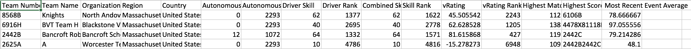

:Author: Jerry Wang
:Date: Mar 16, 2017

General Information
===================

This repository includes script for collecting information of a VRC event from vexDB, primarily for better scouting. There are two different versions of script, one is synchronous and another is asynchronous. The asynchronous version should run a lot faster than the synchronous version, especially with slow Internet connection. However, if you are get any weird errors, try to run the synchronous version, as it is tested more. 

Dependencies
============

- aiohttp (only if you are running the asynchronous module)
- requests

To install all dependencies, including optional dependencies recommended by aiohttp, run

.. code:: sh
	
	sudo -H python3.6 -m pip install --upgrade requests aiohttp cchardet aiodns
	

Usage
=====

.. code:: sh

	python3.6 vexDB_data_collector.py [Event Code] [Output Path]

Or, if you are running the asynchronous version

.. code:: sh

	python3.6 vexDB_data_collector_async.py [Event Code] [Output Path]

Arguments
---------

:Event Code: Optional, identifier of the vex event. It should be in format of ``RE-VRC-YY-XXXX``. Default to ``RE-VRC-17-3805``, the event code for 2018 VEX Robotics World Championship High School Division. You can find it on robotevents.com for a specific event. 
:Output Path: Optional, path for the CSV file output. Default to ``/path/to/script/event-name data.csv``

Sample Output
=============

Below is sample output of first five lines of output of 

.. code:: sh

 	python3.6 vexDB_data_collector_async.py RE-VRC-17-4151

Note that the file will be in arbitrary order if you are running the asynchronous version. You can always sort the file based on individual columns using program such as Microsoft Excel. 

Disclaimer
==========

The scripts included in this repository only collect data from vexDB and I have ABSOLUTELY NO IDEA what may go wrong. I do not take responsibility for outputs produced by the script, nor provide any warranty. 